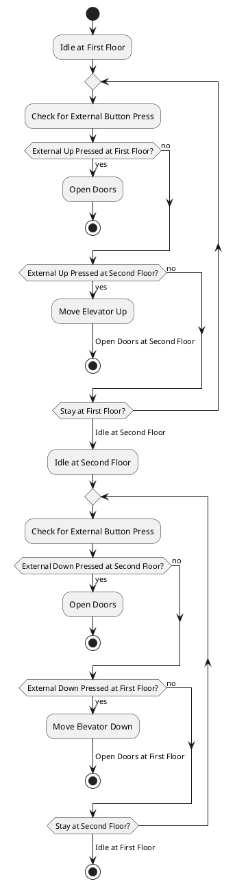

Creating an activity diagram to explain the state machine of the elevator system will help visualize the workflow and interactions between different actions and decisions. This diagram will focus on depicting the sequence of operations and decisions made throughout the elevator's operation cycle.

### PlantUML Code for Elevator System Activity Diagram

### Key Elements of the Activity Diagram:

1. **Start Point**: The elevator begins in an idle state, located either at the first or second floor.
2. **Checking for External Button Presses**: The elevator continuously checks for button presses to determine its next action.
3. **Decision Making**: Decisions based on which button is pressed:
   - If the button press corresponds to the current floor, the doors open.
   - If the button press is for the other floor, the elevator moves to that floor and opens the doors upon arrival.
4. **Repetition and Looping**: The elevator remains in a loop, checking for button presses until a condition to move or open doors is met.
5. **Transitions Between Floors**: Transitioning between "Idle at First Floor" and "Idle at Second Floor" reflects the elevator's movement in response to button presses.
6. **End Points**: Each activity path ends when the elevator completes its intended operation (e.g., doors open, or it arrives at a floor).

This activity diagram is structured to guide through the actions and decisions in the operation of a two-floor elevator system, matching the behavior defined in the state machine. It provides a clear sequence of operations, making it easier to understand the flow and functionality of the elevator system. If you need adjustments or additional details added to this diagram, let me know!