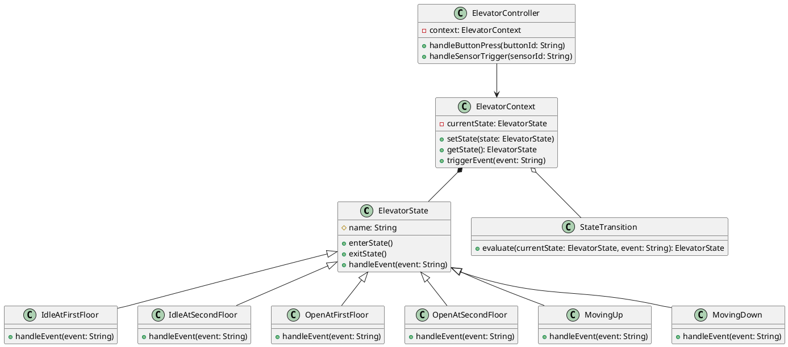

Creating a class diagram for the `State Management` component of our elevator simulation will help in defining the classes needed to simulate the state transitions of the elevator system effectively. This component will manage the internal states of the elevator and handle transitions based on input from various sensors and user interfaces.

### Class Diagram for State Management Component

The class diagram will include classes to represent the different states, manage transitions, and handle events:

1. **ElevatorState**: An abstract base class for different elevator states.
2. **IdleAtFirstFloor**, **IdleAtSecondFloor**, **OpenAtFirstFloor**, **OpenAtSecondFloor**, **MovingUp**, **MovingDown**: Concrete state classes that inherit from `ElevatorState`.
3. **ElevatorContext**: A class that maintains the current state of the elevator and allows state transitions.
4. **StateTransition**: A class to handle the transition logic based on events.
5. **ElevatorController**: The main class that interacts with the UI and sensor systems, dispatching events to `ElevatorContext`.

Here’s how you might represent these components in PlantUML format:

### Explanation of the Diagram:

- **ElevatorState**: This abstract class provides a template for all specific state classes. It includes methods to handle entering and exiting states and responding to events.
- **Concrete State Classes**: Each specific state class implements how to handle events while in that state.
- **ElevatorContext**: Manages the current state of the elevator and facilitates state transitions by using the StateTransition class to decide the next state based on current state and events.
- **StateTransition**: Contains logic to determine the next state based on the current state and an event.
- **ElevatorController**: Serves as the façade through which external systems interact with the elevator state management system. It processes button presses and sensor triggers.

This class diagram sets the foundation for implementing the state machine logic in the elevator simulation. If you have specific methods or functionalities in mind that you’d like to explore or clarify, please let me know, and we can expand on this design!