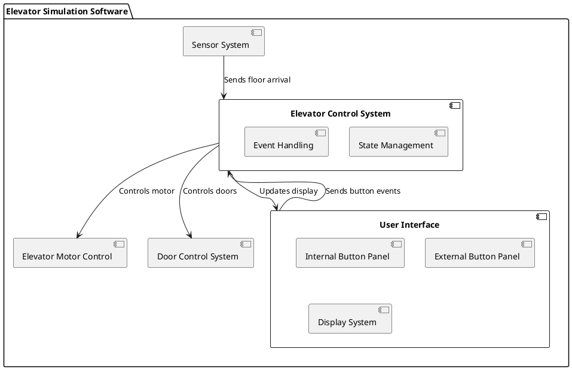

Designing a software simulation for the elevator control logic starts with creating a component diagram to outline the system's architecture. This diagram will show how various software components interact and are organized, which is essential for building a clear, modular, and maintainable system.

### Component Diagram for Elevator Simulation Software

The component diagram for the elevator simulation software will include the following key components:

1. **Elevator Control System**: The central component that manages the state transitions and the elevator's logic.
2. **User Interface (UI)**: Interfaces for internal and external button inputs, as well as displaying the current state of the elevator.
3. **Elevator Motor Control**: Manages the physical aspects of the elevator movement (up or down).
4. **Door Control System**: Controls the opening and closing of the elevator doors.
5. **Sensor System**: Includes sensors that detect the current floor and whether the elevator has arrived at the target floor.

Here is a basic representation of these components in PlantUML format:

### Explanation of the Diagram:

- **Elevator Control System (ECS)**: This is the central component that processes all events and manages the state transitions based on the button presses and sensor inputs. It controls the motor and door operations and updates the UI.
- **User Interface (UI)**: Handles interactions with users both inside and outside the elevator. It captures button presses and displays the elevator's current state (like the current floor and door status).
- **Elevator Motor Control (EMC)**: Receives commands from the ECS to start or stop the elevator moving up or down.
- **Door Control System (DCS)**: Operates the doors, opening or closing them based on commands from the ECS.
- **Sensor System**: Detects and sends signals about the elevator's position and whether it has reached the desired floor.

This component diagram provides a high-level overview of how the elevator simulation software is structured. It lays the groundwork for further development, including defining the interfaces between components and detailing the behavior of each component. If you want to delve deeper into any specific component or add additional features, let me know how you would like to proceed!