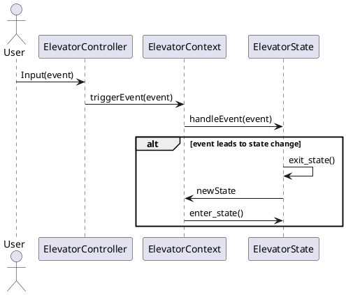

Creating a sequence diagram will help illustrate the flow of interactions between the components of our elevator simulation as events are processed. This diagram will show how the user inputs are handled, how state transitions occur, and how the system components communicate with each other throughout the process.

### Sequence Diagram for Elevator Simulation

Here's a description of what the sequence diagram will include, followed by the PlantUML code to generate it:

- **Actors and Components**:
  - **User**: Triggers events through the command interface.
  - **ElevatorController**: Accepts user inputs and forwards events to the `ElevatorContext`.
  - **ElevatorContext**: Manages the current state and triggers state transitions.
  - **ElevatorState**: An abstract representation of various states like `IdleAtFirstFloor`, `MovingUp`, etc. These handle specific events and manage transitions to other states.

- **Flow of Events**:
  - The User inputs a command.
  - `ElevatorController` receives the command and interprets it as an event.
  - The event is passed to `ElevatorContext`, which then delegates to the current `ElevatorState`.
  - The `ElevatorState` processes the event and may transition to a new state, invoking `enter_state()` on the new state if a transition occurs.

### PlantUML Code for the Sequence Diagram

### How to Read the Diagram:

- **Interaction Start**: The User starts an interaction by inputting an event (like pressing a button).
- **Event Handling**: The `ElevatorController` receives this input and forwards it to the `ElevatorContext`.
- **State Management**: The `ElevatorContext` then invokes the current `ElevatorState` to handle the event.
- **State Transition**: If the event leads to a state change, the current state will execute an `exit_state()` method, and the new state will execute an `enter_state()` method after being set in the `ElevatorContext`.

This sequence diagram provides a clear visualization of the process flow from user input through state transitions within the elevator simulation. It's a useful tool for understanding the dynamic interactions and ensuring that all parts of the system are correctly linked. If you need more details added or have specific scenarios in mind, let me know how we can further refine this diagram!