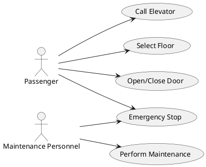

Thank you for the overview of the updated state machine for the elevator system. To effectively communicate this model to stakeholders, a use case diagram will be helpful. This diagram will visualize the interactions between different types of users (actors) and the system itself, highlighting the primary functionalities and use cases supported by the elevator model.

### Use Case Diagram for Elevator System

This use case diagram will include the following actors and use cases:

- **Actors**:
  - **Passenger**: Represents anyone using the elevator.
  - **Maintenance Personnel**: Specialized users who may perform maintenance or emergency operations.

- **Use Cases**:
  - **Call Elevator**: Passengers can call the elevator to their current floor using external buttons.
  - **Select Floor**: Once inside the elevator, passengers can select the floor they wish to go to.
  - **Open/Close Door**: Passengers can command the elevator to open or close its doors when inside.
  - **Emergency Stop**: Maintenance personnel (or possibly passengers) can initiate an emergency stop.
  - **Perform Maintenance**: Maintenance personnel can perform regular checks or maintenance tasks.

### PlantUML Code for Use Case Diagram

Here’s the PlantUML code to generate the use case diagram:

### Explanation of the Diagram:

- **Actors and Use Cases**: This diagram clearly shows who can interact with the elevator system and what they can do. The actors (Passenger and Maintenance Personnel) are linked to specific actions they can take, which correspond to functionalities provided by the system.
- **Use Case Descriptions**:
  - **Call Elevator**: Corresponds to pressing external buttons.
  - **Select Floor**: Involves using internal buttons to choose a destination floor.
  - **Open/Close Door**: Relates to the internal open/close door buttons.
  - **Emergency Stop**: A critical function for safety, allowing the elevator to be stopped immediately under specific conditions.
  - **Perform Maintenance**: Includes tasks like diagnostics, repairs, and system checks, ensuring the elevator operates smoothly.

This diagram should serve as a clear, high-level overview of the elevator system's functionalities, making it easy for stakeholders to understand how the system can be used and what features are available. If you need further details added or adjustments, feel free to let me know!